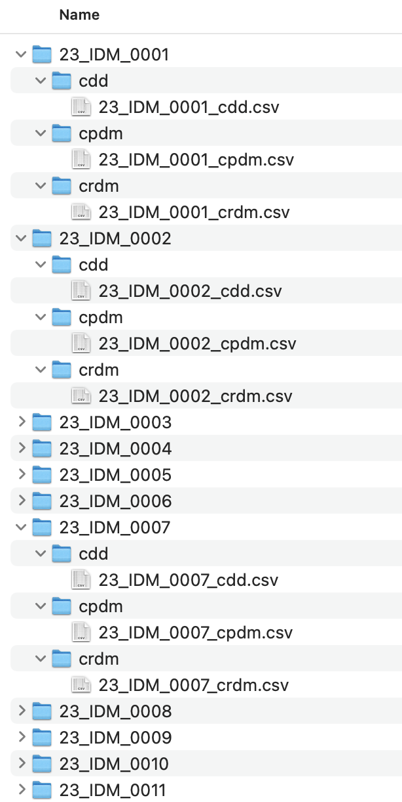

# Bayesian Hierarchical Model (BHM)

In this repository, we developed a Bayesian Hierarchical Model (BHM) to estimate parameters for value-based and confidence-based computational models. 

## Studies and data organization

The code was written to work for each of the studies that the Computational and Decision Neuroscience (CDN) lab is involved:
- IDM: interoceptive decision making
- SDM: States decision making
- SDAN: CDN's collaboration with SDAN (Dany Pine)

In order for the script to work, the datafiles need to be stored in the appropriate [BIDS](https://bids.neuroimaging.io/) format. We have the data located in a folder named `split` where each subject has a folder with the tasks they completed. Under each of the task directories, there is a spreadsheet with the naming convention `subjectname_task.csv`. Below you can see an example for how this looks like for the first 10 participants of the IDM project. 

## Running the corresponding Jupyter notebooks

The code works in modular form to analyze the model parameters from the experiments/tasks in each study. The script `hierarchical_model.ipynb` under each task directory can be executed after editing the path to the study:

- [CRDM](crdm/hierarchical_model.ipynb): confidence and risky decision making
- [CDD](cdd/hierarchical_model.ipynb): confidence and delay discounting
- [CDD_nlh](cpdm/hierarchical_model.ipynb): CDD nonlinear hyperbolic
- [CPDM](cpdm/hierarchical_model.ipynb): confidence and perceptual decision making
